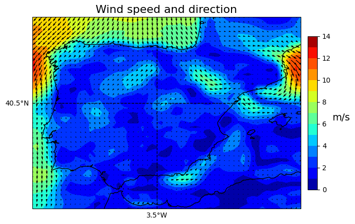

<a name="readme-top"></a>
<!-- https://github.com/othneildrew/Best-README-Template/tree/master -->

<!-- PROJECT LOGO -->
<br />
<div align="center">
  <a href="https://github.com/SamuReyes/WindFormer">
    <!--  -->
  </a>

  <h3 align="center">WindFormer</h3>

  <p align="center">
    Pretraining a Spatio-Temporal Transformer for Wind Forecasting
    <br />
    <br />
    <a href="https://github.com/SamuReyes/WindFormer/issues">Report Bug</a>
    ·
    <a href="https://github.com/SamuReyes/WindFormer/issues">Request Feature</a>
    <p>
    
    </p>
  </p>
</div>

<!-- TABLE OF CONTENTS -->
<details>
  <summary>Table of Contents</summary>
  <ol>
    <li>
      <a href="#about-the-project">About The Project</a>
    </li>
    <li>
      <a href="#getting-started">Getting Started</a>
      <ul>
        <li><a href="#prerequisites">Prerequisites</a></li>
        <li><a href="#installation">Installation</a></li>
      </ul>
    </li>
    <li><a href="#usage">Usage</a></li>
    <li><a href="#future-work">Future Work</a></li>
    <li><a href="#contributing">Contributing</a></li>
    <li><a href="#license">License</a></li>
    <li><a href="#contact">Contact</a></li>
    <li><a href="#acknowledgments">Acknowledgments</a></li>
  </ol>
</details>

<!-- ABOUT THE PROJECT -->
## About The Project

Efficient and accurate wind forecasting presents a substantial challenge in the field of meteorology, particularly when it involves high-resolution data. Accurate prediction of wind speed and direction is crucial for the safety of sectors such as aviation and wind turbines, and for the efficiency of renewable energies. Traditional physical and numerical models often struggle with this complexity, resulting in diminished and slow performance. Similarly, recent advancements in deep learning have introduced encoder-decoder models aimed at improving forecasting accuracy. However, these models continue to face efficiency issues and struggle to balance the trade-off between accuracy and computational demand. This situation underscores the pressing need for innovative solutions capable of surpassing the constraints of current forecasting models by offering both high accuracy and efficiency.

In response to this challenge, WindFormer, a novel transformer-based model inspired by Video Vision Transformers and adapted into a decoder-only architecture, was developed. This design allows WindFormer to effectively capture temporal and spatial patterns in atmospheric data. WindFormer is pre-trained on high-resolution ERA5 reanalysis data that specifically targets a 3D grid across the Iberian Peninsula with a spatial resolution of 0.25º and a temporal granularity of one hour. The goal of WindFormer is twofold: to serve as a robust pre-trained model that can be fine-tuned with observational wind data and to offer efficient predictions over reanalysis data. Such an architecture proves advantageous in handling the vast datasets typical of meteorological analysis and allows for the intricate extraction of relevant features and patterns critical to forecasting. The results of this application demonstrate the effectiveness of WindFormer, achieving similar Root Mean Square Error (RMSE) and Anomaly Correlation Coefficient (ACC) values compared to state-of-the-art models, highlighting its capability to provide accurate and efficient wind speed forecasts using a decoder-only architecture.

This breakthrough not only achieves good results in wind forecasting but also provides a scalable framework that could be adapted for various predictive applications in meteorology and beyond.

<p align="right">(<a href="#readme-top">back to top</a>)</p>

<!-- GETTING STARTED -->
## Getting Started
This section provides guidance on how to get your local machine set up to run the project. By following these instructions, you'll have a local copy of the project up and running.

### Prerequisites
Before you begin, ensure you have met the following requirements:

- Docker: You need Docker installed on your system. If you haven't already done so, download and install Docker for your operating system from [Docker's official website](https://www.docker.com/).
- NVIDIA Drivers (Optional): If you plan to leverage GPU capabilities, ensure you have the [NVIDIA drivers](https://www.nvidia.com/download/index.aspx) installed for Docker to access the GPU.
- Git (Optional): To clone the project repository, you might need Git installed. Download it from [Git's official website](https://git-scm.com/).

### Installation
To install the project, follow these steps:

**Clone the Repository:** 

```bash
git clone https://github.com/SamuReyes/WindFormer
```

**Configure Docker Compose:**

Navigate to the /docker directory and **modify the volume path** in the docker-compose.yml file to match your local project directory. Additionally, you can modify the name of the container that will be created.

**Build the Docker Image:**

In the /docker directory, run the following command to build the Docker image. Replace <user> and <password> with your desired credentials:

```bash
sudo docker build -t wind-prediction -f Dockerfile.pytorch-wind --build-arg USER=<user> --build-arg PASSWORD=<password> .
```

**Start the Docker Container:**

```bash
docker-compose up -d
```

**Accessing the Services:**

"The project is now running inside Docker containers. You can access Jupyter Notebook at http://localhost:8888. 
Additionally, for a more integrated development experience, you can attach to these Docker containers using Visual Studio Code, installing with the 'Remote - Containers' and 'Docker' extensions. 
For direct command-line interactions, use:

```bash
docker exec -it [container_name] /bin/bash
```

By following these steps, you should have the project running on your local machine. If you encounter any issues, please refer to the Docker and Docker Compose documentation for troubleshooting tips.

<p align="right">(<a href="#readme-top">back to top</a>)</p>


<!-- USAGE EXAMPLES -->
## Usage

The project is organized in a modular way, allowing you to execute various functions such as data preprocessing, model training, or model evaluation from the pipeline. Once the environment is set up with Docker, the data extracted from the ERA5 API should be saved in netCDF format in the `project/data/raw` folder. The data can be downloaded using the ERA5 API:

- [Data at various pressure levels](https://cds.climate.copernicus.eu/cdsapp#!/dataset/reanalysis-era5-pressure-levels?tab=form)
- [Surface data](https://cds.climate.copernicus.eu/cdsapp#!/dataset/reanalysis-era5-single-levels?tab=form)

In `project/config/params.yaml`, you can adjust the project's configuration by varying the variables to include, the area of the terrain, the pressure levels to include, model hyperparameters, etc.

<p align="right">(<a href="#readme-top">back to top</a>)</p>

## Future Work

- Train with observational data (see 'surface-real-data' branch.
- Comparisons against state-of-the-art models like [ClimaX](https://github.com/microsoft/ClimaX) or [PanguWeather](https://github.com/rudolfmard/Pangu-Weather-mini?tab=readme-ov-file).

<p align="right">(<a href="#readme-top">back to top</a>)</p>

## Contributing

Contributions are what make the open source community such an amazing place to learn, inspire, and create. Any contributions you make are **greatly appreciated**.

If you have a suggestion that would make this better, please fork the repo and create a pull request. You can also simply open an issue with the tag "enhancement". Don't forget to give the project a star! Thanks again!

1. Fork the Project
2. Create your Feature Branch (`git checkout -b feature/AmazingFeature`)
3. Commit your Changes (`git commit -m 'Add some AmazingFeature'`)
4. Push to the Branch (`git push origin feature/AmazingFeature`)
5. Open a Pull Request

<p align="right">(<a href="#readme-top">back to top</a>)</p>

## License

Distributed under the MIT License. See `LICENSE.txt` for more information.

<p align="right">(<a href="#readme-top">back to top</a>)</p>

## Contact

Samuel Reyes - [LinkedIn](https://www.linkedin.com/in/samuel-reyes-sanz/) - samuel.reyes.sanz@gmail.com

If you find this project interesting and would like to support its development, donations are welcome at [PayPal](https://www.paypal.com/paypalme/samuelreyessanz).

<p align="right">(<a href="#readme-top">back to top</a>)</p>

## Acknowledgments

Special thanks to my supervisors [Carlos Camacho](https://github.com/carloscamachogom) and [Javier Huerta](https://github.com/jahuerta92) for their guidance and support.

<p align="right">(<a href="#readme-top">back to top</a>)</p>

<!-- MARKDOWN LINKS & IMAGES -->
<!-- https://www.markdownguide.org/basic-syntax/#reference-style-links -->

<!-- [Next.js]: https://img.shields.io/badge/next.js-000000?style=for-the-badge&logo=nextdotjs&logoColor=white
[Next-url]: https://nextjs.org/-->
